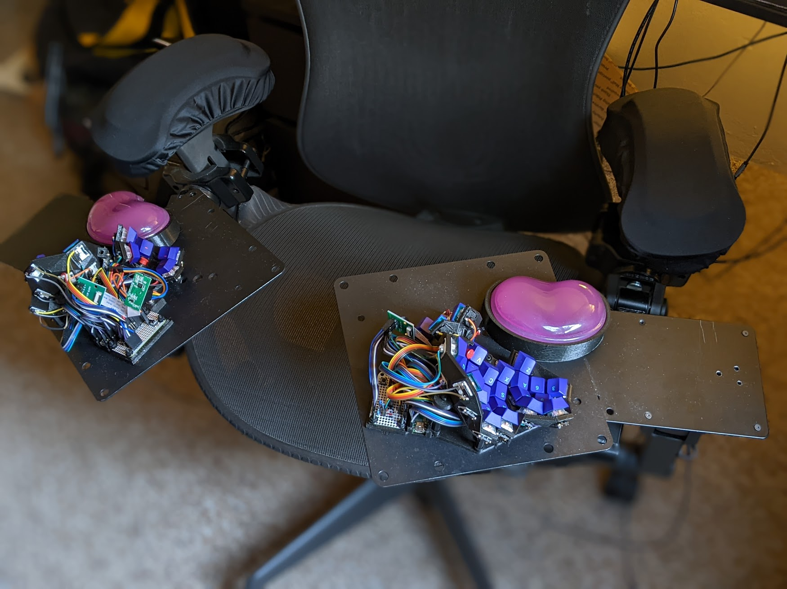
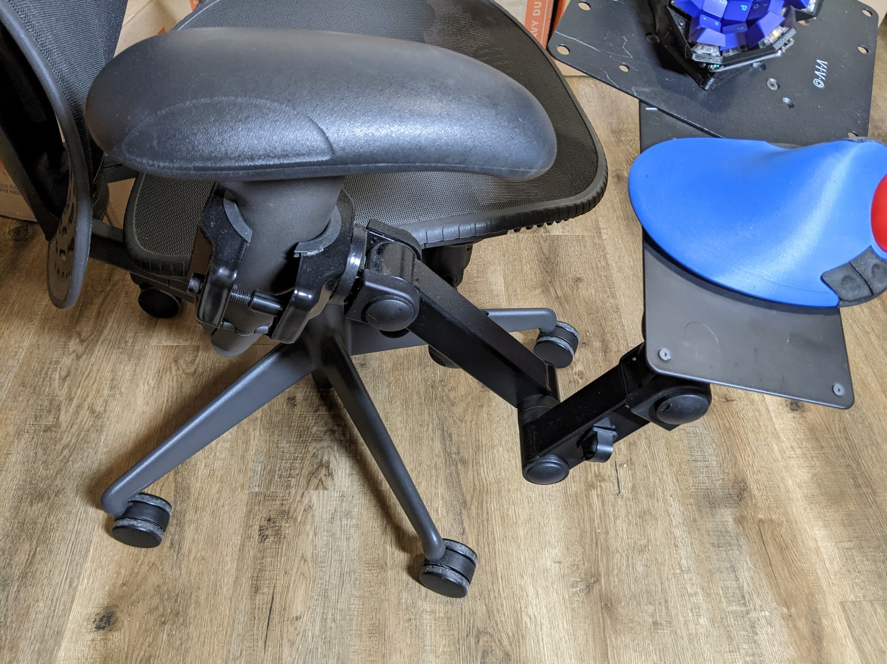
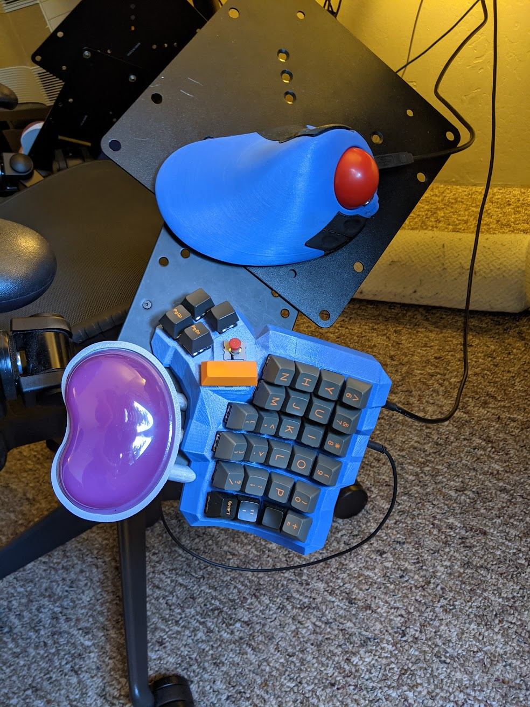
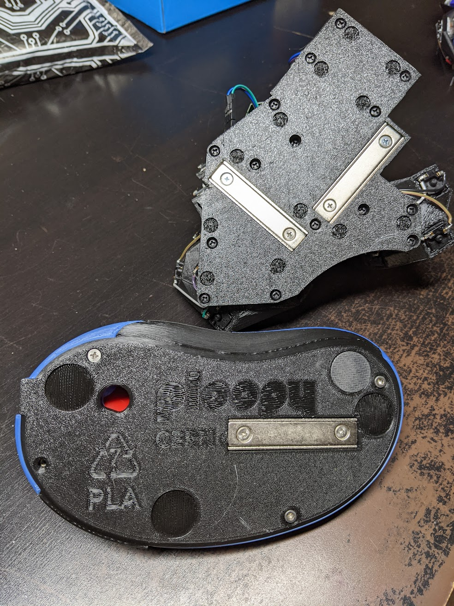

# How I mount my Keyboard to the Arms of my Chair

This keyboard mount technique achieves several things:

* The thin, angled metal plates can get lower in your lap, and closer to your shoulders, than a traditional keyboard tray.
* It has room for a trackball.
* It moves with the chair.
* It provides built-in tent and tilt adjustment, and can be adjusted on the fly.
* It can be rotated out of the way when you get up and down, so halves of a split keyboard can sit closer together than a fixed mount.
* The magnetic mounting which keeps the peripherals from falling off also means you can make small position adjustments naturally, just by sliding around the individual device.

## Parts

This uses a monitor mount, recommended by the HOTAS community (Hands On Throttle And Stick -- flight simulators), that clamps onto the chair arm. The other end is attached to a long plate with VESA holes to match the monitor mount, meant for mounting Intel NUCs behind your monitor. On the other end I stuck an additional VESA adapter plate at a jaunty angle, just to have extra surface to work with.

  * [Monitor mount arm](https://www.amazon.com/gp/product/B00BT7EA18/). It has many degrees of freedom, and it clamps.
  * [NUC VESA mount](https://www.amazon.com/gp/product/B07B44VRL2/). NUCs also uses 100 mm square spacing, but hole diameter is smaller. The NUC mount holes are punched, not countersunk, but it has _almost_ the same effect.
  * [200 mm VESA adapter plate](https://www.amazon.com/gp/product/B07MJTJ6T4/). Inner holes are countersunk so screws will be flush. The only downside is that rubber feet on peripherals can get caught in the numerous screw holes.

I've also tried this big one, but it's shaped weirdly, has large holes, and is not as long as the combo of 2 plates -- not my favorite overall.

  * [400x200 mm VESA adapter plate](https://www.amazon.com/gp/product/B07MCMTCP3/)

Any metal plate with standard VESA 100 mm or 75 mm holes will do, but countersunk holes are _much_ nicer so that screw heads don't catch on your devices. Someday I hope to design a custom shape in a program like Inkscape and get it laser cut by a specialty shop.

### Magnets
Since we want a strong magnetic force in a single direction, cup magnets are ideal for this application.

 - [60x13.5x5mm bar-shaped cup magnet 10 pack](https://www.amazon.com/gp/product/B07T4NX3NC/) These are my preferred magnets. A single magnet is enough to hold a device in position on the keyboard tray.
 - [32mm round cup magnet 6 pack](https://www.amazon.com/gp/product/B08VMWZ54T) These are more compact, but you need to use more than one or you risk the device slowly spinning under its own weight.

### Screws

To attach the NUC mount to the monitor arm I used 3 M3x10 countersunk screws in the punched NUC mounting holes, leaving the hole near my leg empty. The screw heads aren't quite flat, but it's been good enough for a place to stash your trackball. To attach the VESA adapter I used 2 M4x6 screws. In both cases you want screws just long enough to fill the washer and nut without protruding, so it doesn't catch on your leg/clothes.

For the magnets, you want to use non-magnetic (stainless steel 316 will do) screws if possible. Countersunk screw heads will sink into the magnet, leaving the bottom of the device flat. For both magnet shapes I use M3x12 screws, though the round magnets are large enough for M4.  I have happily used nylon washers and nuts to secure screws without issue, but stainless will work too if you prefer it.

## Action Shots

## Magnetic Mounts on Peripherals

For convenience, I've made several openscad modules that can apply a magnet mount to an existing model (including *.stl*s). My favorite mount places a bar shaped cup magnet in a sturdy casing, nearly flush with the bottom of a model. [Code for both bar and round magnet mounts is in my keyboard repository, here.](https://github.com/wolfwood/tryadactyl/blob/try-1/util.scad#L171-L192)

I am also working on submitting a PR for a modified bottom plate for the [ploopy classic trackball](https://ploopy.co).
